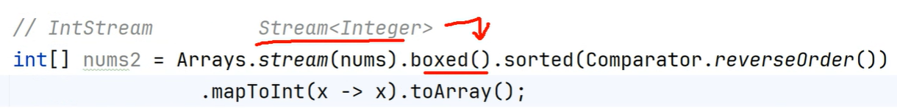

[1. 스트림의 연산](#-1-스트림의-연산) 
[1-2. 스트림의 중간연산](#-1-2-스트림의-중간연산) 
[2. 스트림 만들기](#-2-스트림만들기) 

## 📕 스트림이란?
#### 컬렉션 프레임워크에서 정렬 : Collection.sort()
#### 배열에서 정렬 : Arrays.sort()

> 데이터가 무엇이든지(컬렉션 프레임워크 or 배열 등등)간에 동일한 방식으로 다룰 수 있도록 하는 것

✨ 데이터 처리를 연달아 한꺼번에 진행이 가능하다
> 소스가 간결, 유지 보수성이 좋아짐

 
 

### 📑 1. 스트림의 연산
#### 💾 `StreamEx1`, 💾 `StreamEx2`
___
#### 중간연산
👉 연산의 결과가 스트림이면 중간연산 
#### 최종연산
👉 연산의 결과가 스트림이 아니면 최종연산 
#### 지연된연산
#### 기본 자료형을 다루는 스트림

 
 

### 📑 2. 스트림만들기
#### 💾 `StreamEx3`
___
- 컬렉션
  - `Collection` 인터페이스 -> `stream()`
- 배열
  - `Arrays` 클래스 -> `static stream()`
  - `Stream.of(T[] t)`
  - `Stream.of(T...values)`

- 특정 범위의 정수
  - `IntStream`, `LongStream` 
      - `range(int s, int e);` [s <= X < e]
      - `rangeClosed(int s, int e);` [s <= X <= e]
- 임의의 수
  - java.util.Random()
    - `ints()`
    - `longs()`
    - `doubles()`
- 람다식 : 무한스트림이므로 `limit()`과 함께 사용
  - `iterate()`
  - `generate()`
- 빈 스트림
- 두 스트림의 연결
  - `concat()`

 
 

### 📑 1-2. 스트림의 중간연산
#### 💾 `StreamEx3`, `StreamEx4`, `StreamEx5`, `StreamEx6`
___
- 스트림 자르기
  - `skip()`, `limit()`
- 스트림 요소 걸러내기
  - `filter()`, `distinct()`
- 정렬
  - `sorted()`
- 변환
  - `map()`
  - 일반 -> 기본자료형 : `mapToInt`, `mapToLong`, `mapToDouble`
- 조회
  - `peek()`, `forEach()`와 유사하지만 중간연산자이다.

 

기본 자료형 -> 일반 스트림 변환 메서드
Intstream -> Stream<Integer>
ex) sorted()

 

### 📑 1-3. 스트림의 최종연산
#### 💾 `StreamEx3`, `StreamEx4`, `StreamEx5`, `StreamEx6`, `StreamEx7`
___
- `forEach()`
- 조건 검사
  - `allMatch()`, `anyMatch()`, `noneMatch()`, `findFirst()`
- 통계
  - `count()`, `sum()`, `average()`, `max()`, `min()`
- 리듀싱
  - `reduce()`
- `collect()`
  - 스트림 컬렉션과 배열로 반환
    - `toList()`, `toSet()`, `toMap()`, `toCollection()`, `toArray()`
- 문자열 결합
  - `joining()`
 
 

### 📑 1-4. Optional
#### 📂 `Optional` > 💾 `OptionalEx1`, 💾 `OptionalEx2`
___
#### Optional과 OptionalInt
> ✨ 모든 자료형의 wrapper 클래스 ✨
- OptionalInt, OptionalLong, OptionalDouble

- Optional 객체의 값 가져오기
  - .get()
  - .orElse("기본값") : 널 일경우 출력 값
  - .orElseGet(Supplier<T ... > supplier)
  - .orElseThrow()

[🔍블로그 자세히 보기](https://velog.io/@dani0817/JAVA-%EC%8A%A4%ED%8A%B8%EB%A6%BCStream%EC%9D%B4%EB%9E%80)